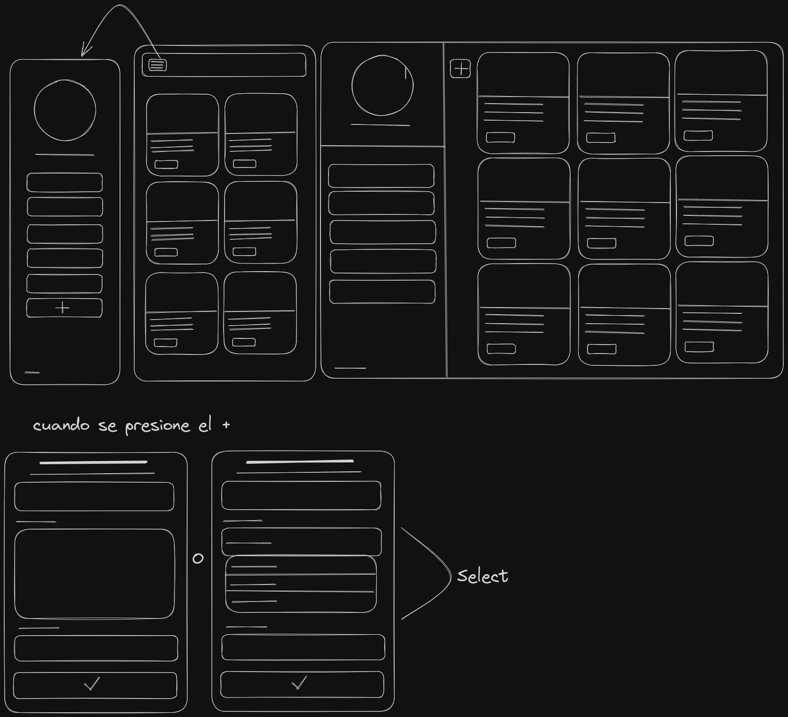
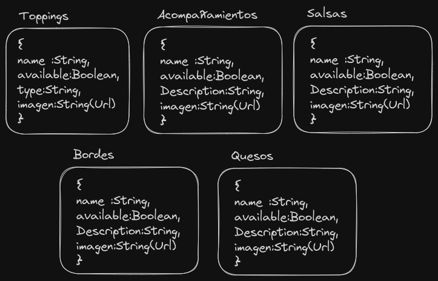

# Prueba-prefiltro

## By Nicolas Ordoñez Ausecha

### WireFrame (Hecho en Excalidraw)


### Esquema de la base de datos


### Diagrama de base de datos

### Como iniciar el proyecto?

- Paso 1: Ubiquese en las carpetas del proyecto del [Backend](./backend/) y el [Frontend](./frontend/frontapi/) (en su debido editor de texto o IDE) e inicailizelas en un terminal de comandos 
- Paso 2: en cada carpeta respectivamente ejecute los siguientes comandos 
```bash
  npm i 
  npm start
```
- Paso 3: ya en el proyecto tiene dos cosas principales que puede hacer 
  * entrar en el lugar de prueba generado por swagger [Aqui](http://localhost:4579/api-docs) **Haber iniciado el servidor(Backend) desde antes**
  * entrar directamente al entorno grafico que al iniciar el servidor en frontend se despliega automaticamente

### Tecnologias Usadas 
- NODE.js (Backend)
- MongoDB (Base de datos)
- ReactJS (Frontend)
- Express (Framework para el servidor)
- Axios  (Cliente HTTP para NODE.js y el Buscador)

### Dependencias

## Dependencias

### [cors](https://www.npmjs.com/package/cors)
**Descripción:** `cors` es un middleware de Express utilizado para habilitar la comunicación entre servidores web en diferentes dominios.

### [dotenv](https://www.npmjs.com/package/dotenv)
**Descripción:** `dotenv` es una biblioteca que facilita la gestión de variables de entorno en aplicaciones Node.js.

### [express](https://www.npmjs.com/package/express)
**Descripción:** `express` es un popular marco de desarrollo de Node.js que simplifica la creación de aplicaciones web y API.

### [mongodb](https://www.npmjs.com/package/mongodb)
**Descripción:** `mongodb` se refiere a la base de datos NoSQL MongoDB.

### [swagger-jsdoc](https://www.npmjs.com/package/swagger-jsdoc)
**Descripción:** `swagger-jsdoc` es una herramienta que permite documentar automáticamente una API Express utilizando comentarios en el código fuente de tu aplicación.

### [tailwindcss](https://www.npmjs.com/package/tailwindcss)
**Descripción:** `tailwindcss`  es un framework CSS altamente personalizable y de bajo nivel que proporciona clases de utilidad para construir rápidamente interfaces de usuario. Permite crear diseños modernos y receptivos rápidamente sin necesidad de escribir CSS personalizado.


### [swagger-ui-express](https://www.npmjs.com/package/swagger-ui-express)
**Descripción:** `swagger-ui-express` es una biblioteca de Express que proporciona una interfaz de usuario generada automáticamente para interactuar con las especificaciones Swagger/OpenAPI.

